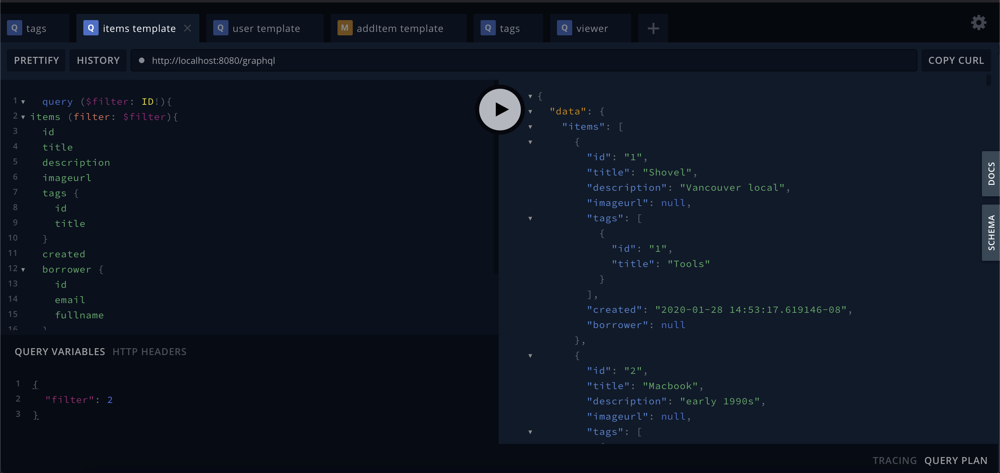
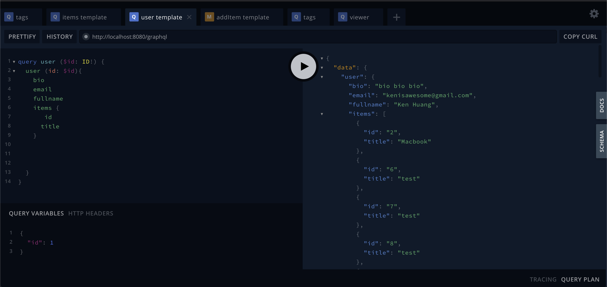

# Boomtown Part One and Two

## Installation Instructions

To view and access this project, please follow the instructions below:

## Server

Access the server directory, then:

### Installation

`yarn install`

### Run

`yarn run start:dev`

## Client

Acess the client directory, then:

### Installation

`yarn install`

### Run

`yarn start`

### Build

`yarn start`

## Reference Images

items query demo

user query demo

## Technologies Used

### Express

### Apollo Server

### Postgres

### GraphQL

### Node.JS

### Material UI

### Apollo Server Express

### BCrypt

### Chalk

### Cookie Parser

### CORS

### JSON Web Token

## Personal Learnings

- Databases are like warehouses, and Apollo Server is a retrieval system - the schema serves as a blueprint of how the warehouse is organized, and resolvers are the carts that navigate through different parts of the warehouse to retrieve the necessary information. It is crucial to have a clear and logical schema as well as an understanding of how to navigate through the schema
- Destructuring is useful for breaking down objects in order to access the necessary information and only the necessary information
